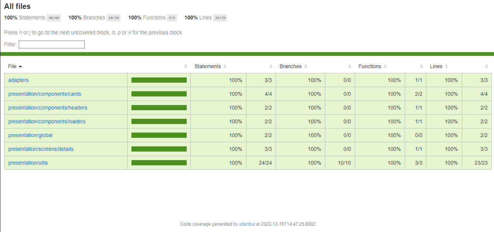
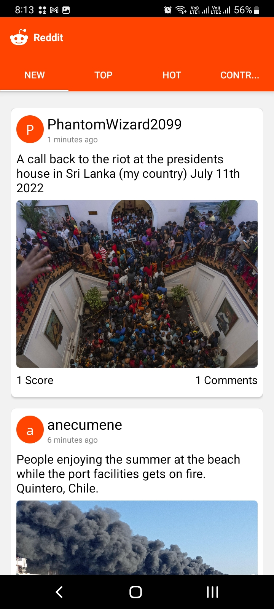
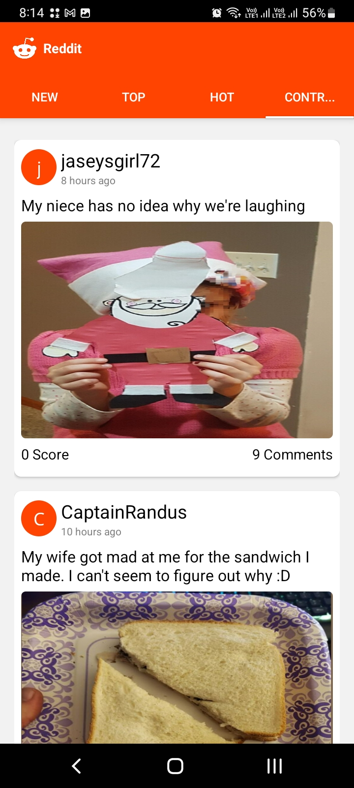
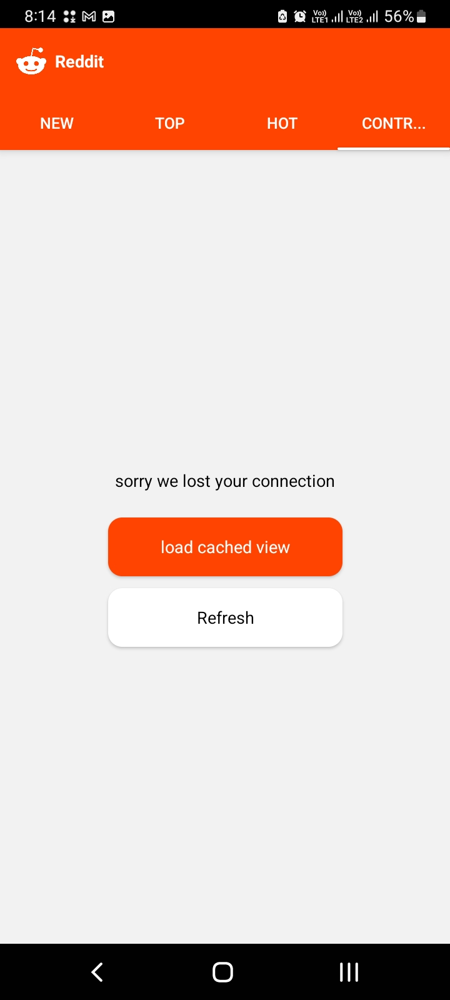

# React Native Coding Challenge

In this challenge you're going to create a basic Reddit app with React Native

Reddit is a news website where registered users can submit posts or links to content that other users can vote and comment. Each of these posts is grouped into categories known as "subreddits".

Your web app should list the last posts of the r/pics subreddit.

To obtain the list of posts of a subreddit use the following URL:
https://api.reddit.com/r/pics/hot.json

For more information about the JSON structure see:
https://github.com/reddit/reddit/wiki/JSON

## Requirements:

- Show a list of the posts in the r/pics subreddit
- Each post must show the following data: thumbnail image (if present), title, author, total number of votes (score), number of comments and date of creation
- Example layout (basic example):

  

- Once the user taps on a post navigate to the post’s URL in a WebView
- A brief explanation of your design and assumptions along with your code.

## What will we evaluate?

- Code quality
- Usage of patterns
- Networking code
- Language skills
- Project structure

## Extra points (not required):

- Unit tests



- Date of creation in a relative format (e.g. “1 day ago”)



- Ability to sort the posts list (“top”, “new”, “hot” or “controversial”)




- Data caching



## Guide

The following project is based on a reddit copy for posts per user.

For its creation, the following technology such as react native and libraries such as react-redux, redux-toolkit, redux persist and asyncStorage were implemented to manage information in a more controlled way and save information in memory.

On the other hand, the mobile application works with typescript so that the code is scalable, simple and clean. a folder structure with clean architecture of the hexagonal type was implemented - [Clean Architecture](https://medium.com/@ganeshraj020794/clean-architecture-in-react-native-38025e2d7223#:~:text=This%20is%20the%20folder%20structure,the%20component%20and%20its%20presenter)

The following points were worked on:
Such as the consumption of the reddit api using fetch.
The search by categories was implemented (top, hot, controversial, new).
The unit tests of the application were carried out with jest.
The storage of information was integrated when the network is disconnected and to see the search results again without having a network.
The time date of the creation of a publication was created as recent, yesterday, 5 minutes ago, etc.
Touching the publication directs you with a webview to the original publication of that publication

As a personal touch, the netinfo library was implemented to notify the user that they do not have a network and allow a better user experience, in addition to that, it allows refreshing if the network has returned and loading the latest publications found through asyncStorage

## Run Locally

Clone the project

```bash
  git clone https://github.com/Jmestrelozano/Reddit.git
```

Go to the project directory

```bash
  cd my-project
```

Install dependencies

```bash
  npm install
```

Start the server

```bash
  npm run android
```

## Running Tests

To run tests, run the following command

```bash
  npm run test
```

To run coverage, run the following command

```bash
  npm run coverage
```

## Build Apk

```bash
https://drive.google.com/file/d/1LkDlwZPgIujPjYSamfUNe2Hq3kNGzuTN/view?usp=sharing
```
